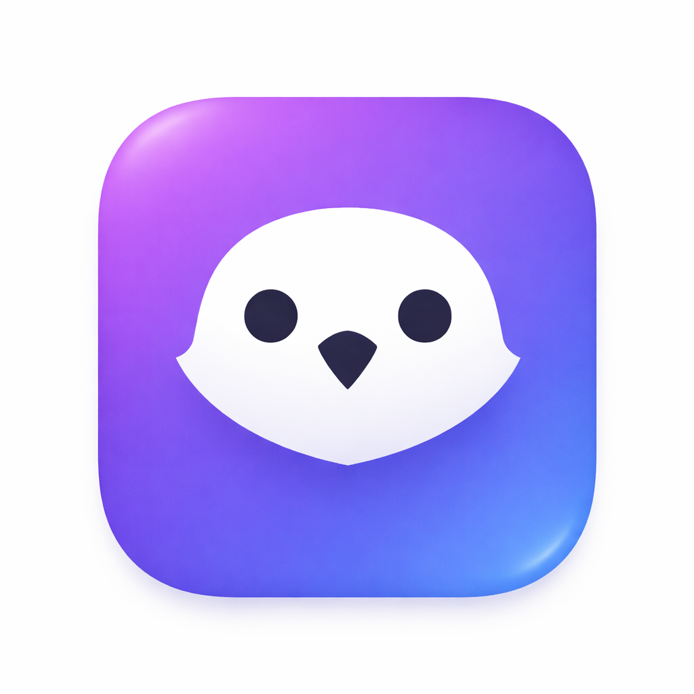

# DiscordBot Native (SwiftUI macOS)

A native macOS Discord bot dashboard app written in SwiftUI and Swift Concurrency (`async/await` + actors). It connects directly to Discord Gateway and REST APIs with no Electron or Node.js runtime.

## Preview

### App Icon



### App UI


## Features

- Native SwiftUI desktop UI pages:
  - Overview
  - Server Notifier
  - Commands
  - Logs
  - Settings
  - Status
- Discord Gateway (`wss://gateway.discord.gg/?v=10&encoding=json`) connection
  - Handles hello, heartbeat, identify, reconnect, and invalid session flow
- Discord REST sending via `https://discord.com/api/v10`
- Server Notifier rule engine:
  - Triggers: user joins/leaves/moves voice, message contains
  - Conditions: server, voice channel, username contains, minimum duration
  - Actions: send message, add log entry, set status
- Per-guild notification channel configuration and ignore/monitor lists
- Voice presence tracking (join/move/leave) with session timing and recent activity panels
- Command system with prefix and commands:
  - `!help`
  - `!ping`
  - `!roll NdS`
  - `!8ball <question>`
  - `!poll "Question" "Option 1" "Option 2"`
  - `!userinfo [@user]`
  - `!setchannel #channel`
  - `!ignorechannel #channel|list|remove #channel`
  - `!notifystatus`
- Logs view with auto-scroll, clear, and copy functionality
- Status view showing gateway stats and voice presence information
- On-device Apple Intelligence replies:
  - Optional smart DM replies (Beta) when enabled in Settings
  - Smart replies on @mentions in guild channels using on-device Apple Intelligence (Beta)
- Persistent settings and rules saved in Application Support JSON

## Roadmap / Want To Add

- General server notifications (join/leave events, voice activity, session duration)
- Voice session tracking for analytics and summaries
- AI patch note summaries using a local LLM
- Notification channel auto-cleanup (e.g. clear every 24 hours)
- Weekly server activity summaries based on logged usage
- Game/wiki data lookup commands (e.g. weapon stats from a game wiki)
- Improved rule builder UI with drag-and-drop automation
- Plugin system to extend features modularly
- Web dashboard / remote access with Discord SSO
- Improved macOS UI design (modern SwiftUI / glass-style interface)

## Commands

- `!help`
- `!ping`
- `!roll NdS`
- `!8ball <question>`
- `!poll "Question" "Option 1" "Option 2"`
- `!userinfo [@user]`
- `!setchannel #channel`
- `!ignorechannel #channel|list|remove #channel`
- `!notifystatus`

Unknown commands return:

`❓ I don't know that command! Type !help to see all available commands.`

## On-Device AI DM Replies (Beta)

- Uses Apple on-device Foundation Models when available.
- Controlled via Settings toggle: `Enable on-device intelligent DM replies (Beta)`.
- Disabled by default.

## Build in Xcode

1. Open this folder in Xcode 15+.
2. Open `DiscordBotApp.xcodeproj`.
3. Select the `DiscordBotApp` scheme.
4. Build and run the macOS app target.

## Build Standalone `.app`

Use the helper script to build and package a runnable app bundle:

```bash
./BUILD_APP.sh


