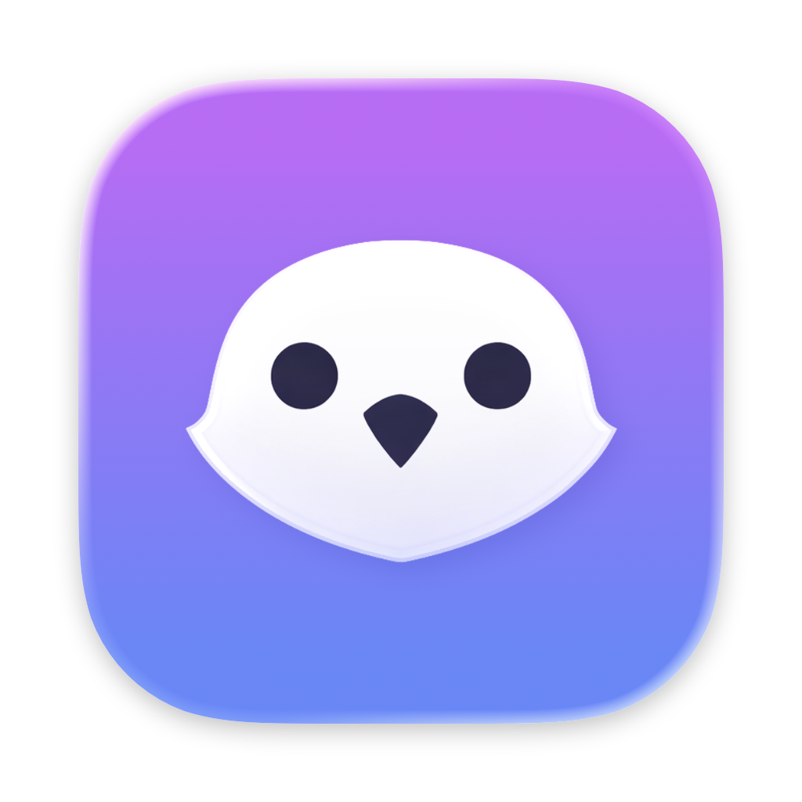
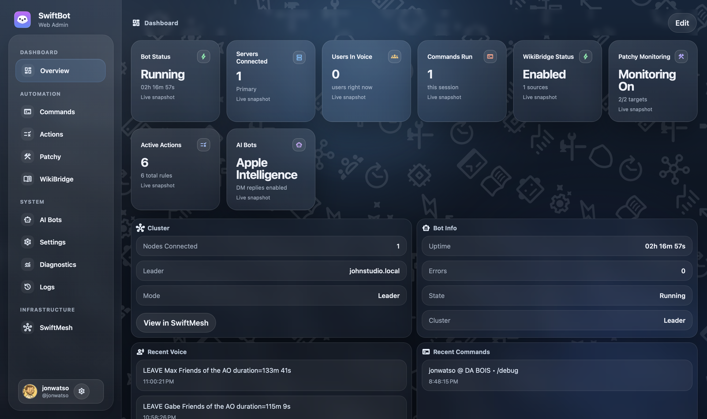

<p align="center">
  
</p>

<h1 align="center">SwiftBot - Native macOS Discord Bot Dashboard</h1>

<p align="center">
  Run, configure, monitor, and automate a Discord bot from a native macOS app.
</p>

<p align="center">
  
  
  
  
  
</p>

**SwiftBot** is a native macOS application for running and managing a Discord bot without living in config files or terminal sessions. Built with Swift and SwiftUI, it provides a single dashboard for bot setup, Discord automation, commands, diagnostics, AI providers, update monitoring, and SwiftMesh failover.

It is designed for people who want a Discord bot they can actually operate day to day: start it, inspect it, adjust rules, check health, and ship updates from one macOS interface.

SwiftBot can be used as a single local bot runner or as part of a SwiftMesh setup where one primary node handles Discord output and standby nodes can take over.

## Overview

SwiftBot connects to Discord through the Gateway and REST APIs, then exposes the bot runtime through a native macOS dashboard.

The app handles:

- Discord bot onboarding and token validation
- Server invite link generation
- Slash command routing
- Voice, message, and member-join automation
- Patchy update monitoring for AMD, NVIDIA, Intel, and Steam
- WikiBridge-backed knowledge commands
- AI reply flows through Apple Intelligence, Ollama, and OpenAI
- SwiftMesh primary and failover coordination
- Runtime logs, diagnostics, and connection checks

## Why This Exists

I wanted a Discord bot that felt like a Mac app instead of a pile of scripts.

Most bots are powerful once configured, but routine operation can be awkward: tokens live somewhere, rules live somewhere else, logs are separate again, and diagnosing Discord permissions or gateway state usually means digging through code or console output.

SwiftBot brings those pieces together in one place. It is intended to make the bot easier to run, easier to inspect, and easier to evolve without losing track of what is happening.

## What SwiftBot Does

- Runs a native Discord bot runtime from macOS
- Guides first-time setup with token validation and invite link generation
- Supports Discord slash commands
- Provides command logging and channel configuration
- Builds automation rules for voice events, messages, and member joins
- Sends update notifications through Patchy monitoring targets
- Adds wiki-backed commands through WikiBridge sources
- Connects AI reply flows to Apple Intelligence, Ollama, or OpenAI
- Stores Discord bot tokens securely in macOS Keychain
- Caches Discord metadata for offline configuration
- Provides diagnostics for gateway, REST, latency, permissions, intents, and rate limits
- Supports SwiftMesh failover for primary and standby bot nodes
- Includes Sparkle appcast support for app updates

## Preview

<p align="center">
  
</p>

<p align="center">
  
</p>

## How It Works

- A Discord application and bot token are created in the Discord Developer Portal
- SwiftBot validates the token and generates the server invite link
- The app connects to Discord through the Gateway and REST APIs
- Commands and automation rules are processed locally by the SwiftBot runtime
- Patchy checks configured update sources and sends Discord notifications when needed
- WikiBridge resolves enabled knowledge sources for dynamic commands
- AI providers are routed through configured local or remote engines
- SwiftMesh coordinates which node is allowed to send Discord output

The macOS app sits on top of these services and presents their state in a single interface.

## Install

Download the latest release from [GitHub Releases](https://github.com/johnwatso/SwiftBot/releases).

1. Download the latest `.zip`
2. Move `SwiftBot.app` to `/Applications`
3. Launch SwiftBot
4. Complete Discord bot onboarding

Future updates are handled in-app through Sparkle auto-updates.

## Discord Bot Setup

SwiftBot requires a Discord application with a bot user.

1. Open the [Discord Developer Portal](https://discord.com/developers/applications)
2. Click **New Application**
3. Give the application a name, such as `SwiftBot`
4. Open the **Bot** section
5. Click **Add Bot**
6. Enable the required **Privileged Gateway Intents**:
   - Server Members Intent
   - Message Content Intent
7. Copy the **Bot Token**

Paste the token into SwiftBot during onboarding. After the token is validated, SwiftBot will generate the correct server invite link for your bot.

Invite the bot to your server using that generated link, then complete onboarding.

## Releases vs. Development Builds

The latest GitHub release is the most stable version.

Building from the current branch includes newer changes that may not have been released yet. These builds can contain bugs, incomplete features, or breaking changes.

## Requirements

- macOS 26+
- Discord bot application and token
- Internet access

## Application Areas

| Area | Purpose |
| --- | --- |
| Overview | Bot status, activity, and high-level runtime state |
| Voice / Actions | Rule builder for voice, message, and member-join automation |
| Commands / Command Log | Command controls and recent command activity |
| WikiBridge | External knowledge source management and dynamic command setup |
| Patchy | Driver, platform, and Steam update monitoring |
| AI Bots | Apple Intelligence, Ollama, and OpenAI configuration |
| Diagnostics | Gateway, REST, permissions, intents, and health checks |
| SwiftMesh | Primary, standby, failover, and mesh diagnostics |
| Logs / Settings | Token management, runtime logs, updates, and app configuration |

## Commands

SwiftBot uses Discord slash commands, and WikiBridge can add commands from enabled sources.

Common commands include:

- `help`
- `ping`
- `roll`
- `8ball`
- `poll`
- `userinfo`
- `setchannel`
- `ignorechannel`
- `notifystatus`
- `debug`
- `bugreport`
- `weekly`
- `image`
- `imagine`
- `meta`
- `wiki`
- `cluster`

Additional slash commands include `compare`, `logabug`, and `featurerequest`.

## Storage

SwiftBot stores application data in `~/Library/Application Support/SwiftBot/`.

Common files include:

- `settings.json`
- `rules.json`
- `discord-cache.json`
- `mesh-cursors.json`

Bot tokens are stored securely in macOS Keychain.

## Project Layout

```text
SwiftBotApp/             macOS app, SwiftUI interface, Discord runtime, diagnostics, and SwiftMesh
Sources/UpdateEngine/    reusable update-checking engine used by Patchy
Tools/SparklePublisher/  Sparkle publishing helper
Tests/SwiftBotTests/     application test suite
docs/                    GitHub Pages site, release notes, and Sparkle appcasts
notes/                   internal planning, design, and review docs
```

## Architecture

SwiftBot is a native Xcode project built around a SwiftUI app shell and a set of service layers for Discord, automation, Patchy monitoring, WikiBridge, AI routing, persistence, and SwiftMesh coordination.

The reusable `UpdateEngine` package lives under `Sources/UpdateEngine` and powers Patchy's update-source checks.

## Notes and Risk

> [!CAUTION]
> SwiftBot depends on Discord APIs, gateway behavior, and bot permissions.
>
> Discord can change platform behavior, API constraints, gateway requirements, or policy expectations over time. Keep the app updated and review Discord's developer policies for your own use case.

<!-- markdownlint-disable-next-line MD028 -->
> [!WARNING]
> Bot permissions and privileged gateway intents must be configured correctly in the Discord Developer Portal and on the target server.
>
> Missing intents or channel permissions can prevent commands, member events, message triggers, or notifications from working.

<!-- markdownlint-disable-next-line MD028 -->
> [!WARNING]
> SwiftMesh failover is designed to avoid duplicate Discord output, but clustered bot setups should still be tested carefully before relying on them for important servers.

<!-- markdownlint-disable-next-line MD028 -->
> [!NOTE]
> SwiftBot is under active development. Features, UI, and configuration may change between releases while core systems are refined.

<!-- markdownlint-disable-next-line MD028 -->
> [!NOTE]
> Patchy update results depend on third-party vendor pages and Steam metadata. Those sources can change without warning.

## Issues

Please raise a GitHub issue if something breaks, behaves unexpectedly, or needs attention.

When reporting runtime problems, include the SwiftBot version, macOS version, the affected area of the app, and any relevant diagnostics or log output from the app.

## Related Docs

- [Architecture](ARCHITECTURE.md)
- [AI Guide](AI_GUIDE.md)
- [Feature Plan](notes/FEATURE_PLAN_PHASE1.txt)

## Releases

- [GitHub Releases](https://github.com/johnwatso/SwiftBot/releases) for installers and release notes
- [Stable appcast](https://johnwatso.github.io/SwiftBot/appcast.xml)
- [Beta appcast](https://johnwatso.github.io/SwiftBot/beta/appcast.xml)

Sparkle uses the published appcasts to deliver automatic updates after installation.

## License

MIT
