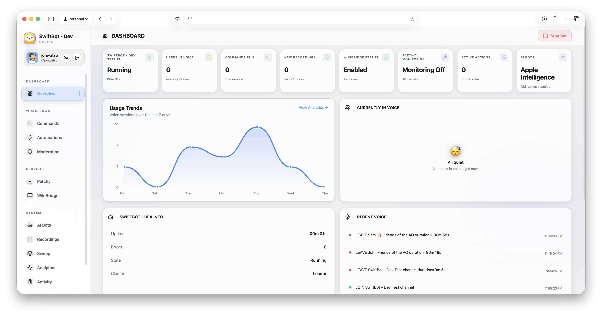

<p align="center">
  <picture>
    <source media="(prefers-color-scheme: dark)" srcset="assets/readme/app-icon-dark.png">
    <source media="(prefers-color-scheme: light)" srcset="assets/readme/app-icon-light.png">
    
  </picture>
</p>

<h1 align="center">SwiftBot - Native macOS Discord Bot Dashboard</h1>

<p align="center">
  Run, configure, monitor, and automate a Discord bot from a native macOS app.
</p>

<p align="center">
  
  
  
  
  
</p>

**SwiftBot** is a native macOS app for running and managing a Discord bot without living in config files or terminal sessions. Built with Swift and SwiftUI, it provides a single dashboard for bot setup, automation, commands, diagnostics, AI providers, update monitoring, and SwiftMesh failover.

It can run as a single local bot or as part of a SwiftMesh setup where a primary node handles Discord output and standby nodes can take over.

## Preview

### App Preview

<p align="center">
  <picture>
    <source media="(prefers-color-scheme: dark)" srcset="assets/readme/ui-preview-dark.png">
    <source media="(prefers-color-scheme: light)" srcset="assets/readme/ui-preview-light.png">
    
  </picture>
</p>

### Web UI Preview

<p align="center">
  <picture>
    <source media="(prefers-color-scheme: dark)" srcset="assets/readme/webui-preview-dark.png">
    <source media="(prefers-color-scheme: light)" srcset="assets/readme/webui-preview-light.png">
    
  </picture>
</p>

## Features

- Native Discord bot runtime with token validation and invite link generation
- Slash commands, command logging, and channel configuration
- Automation rules for voice events, messages, and member joins
- Patchy update notifications (AMD, NVIDIA, Intel, Steam)
- WikiBridge-backed knowledge commands
- AI reply flows via Apple Intelligence, Ollama, or OpenAI
- Diagnostics for gateway, REST, latency, permissions, intents, rate limits
- SwiftMesh primary/standby failover
- Keychain-stored tokens, cached Discord metadata, Sparkle auto-updates

## Setup

For full installation and setup instructions, visit **[swiftbot.dev/help](https://swiftbot.dev/help/)**.

- ➡️ **[Install Guide](https://swiftbot.dev/help/install/)** — download, install, requirements, updates.
- ➡️ **[Bot Setup Guide](https://swiftbot.dev/help/bot-setup/)** — Discord application, token, intents, OAuth, troubleshooting.
- ➡️ **[Web UI Setup Guide](https://swiftbot.dev/help/web-ui/)** — local-only vs public access (Cloudflare Tunnel, reverse proxy).


## Application Areas

**Dashboard**
- **Overview** — bot status, recent activity, and high-level runtime state

**Workflows**
- **Commands** — slash command controls, channel routing, and moderation command toggles
- **Automations** — rule builder for voice, message, and member-join events
- **Moderation** — server moderation rules and enforcement

**Services**
- **Patchy** — driver, platform, and Steam update monitoring
- **Sweep** — channel cleanup and message housekeeping
- **WikiBridge** — external knowledge sources and dynamic command setup
- **Recordings** — captured media from the last 24h

**System**
- **AI Bots** — Apple Intelligence, Ollama, and OpenAI configuration
- **Analytics** — usage metrics and engagement insights
- **Activity** — runtime logs and event history
- **SwiftMesh** — primary/standby coordination, failover, and cluster diagnostics

## Storage

App data lives in `~/Library/Application Support/SwiftBot/` (`settings.json`, `rules.json`, `discord-cache.json`, `mesh-cursors.json`). Bot tokens are stored in macOS Keychain.

## Project Layout

```text
Sources/SwiftBot/        macOS app, SwiftUI interface, Discord runtime, diagnostics, SwiftMesh
Sources/UpdateEngine/    reusable update-checking engine used by Patchy
Tools/SparklePublisher/  Sparkle publishing helper
Tests/SwiftBotTests/     application test suite
Website/                 GitHub Pages site (public/), release notes, Sparkle appcasts
Documentation/           architecture, AI, and design references
```

## Notes

> [!CAUTION]
> SwiftBot depends on Discord APIs, gateway behavior, and bot permissions, which can change over time. Keep the app updated and review Discord's developer policies.

> [!WARNING]
> Bot permissions and privileged gateway intents must be configured correctly. Missing intents or channel permissions can prevent commands, member events, message triggers, or notifications from working.

> [!NOTE]
> SwiftBot is under active development — features, UI, and configuration may change between releases.

## Issues

Please raise a GitHub issue if something breaks. Include the SwiftBot version, macOS version, affected area, and any relevant diagnostics or log output.

## Related Docs

- [Help & Setup Guides](https://swiftbot.dev/help/)
- [Architecture](Documentation/ARCHITECTURE.md)
- [AI Guide](Documentation/AI_GUIDE.md)

## Releases

- [GitHub Releases](https://github.com/johnwatso/SwiftBot/releases)
- [Stable appcast](https://johnwatso.github.io/SwiftBot/appcast.xml) · [Beta appcast](https://johnwatso.github.io/SwiftBot/beta/appcast.xml)

## License

MIT
